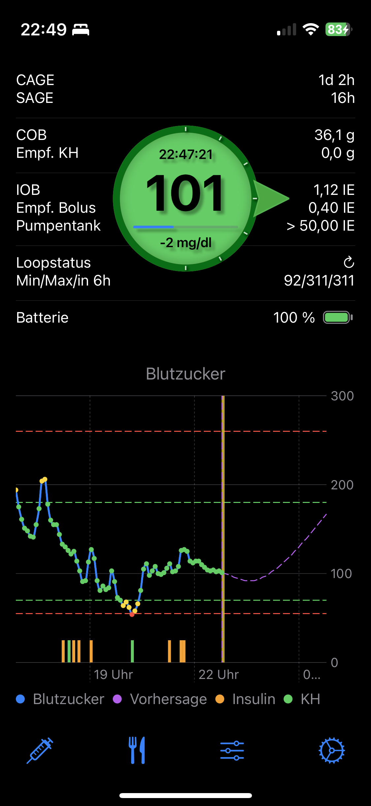
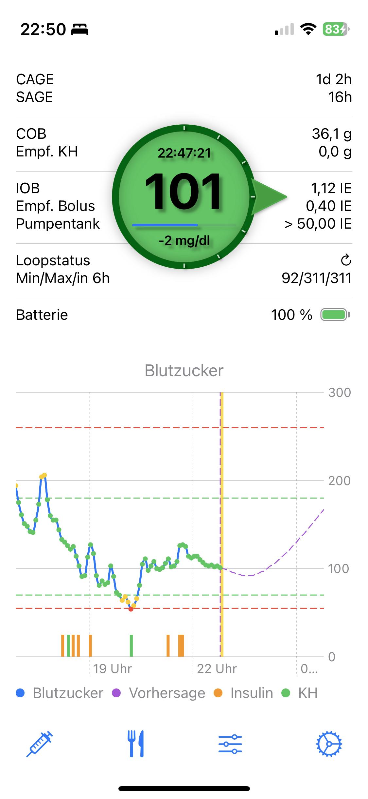
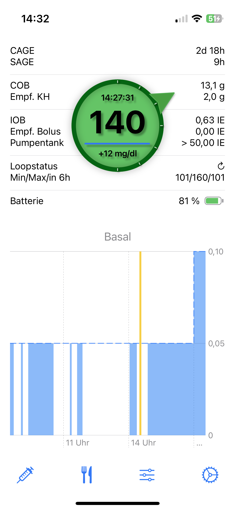
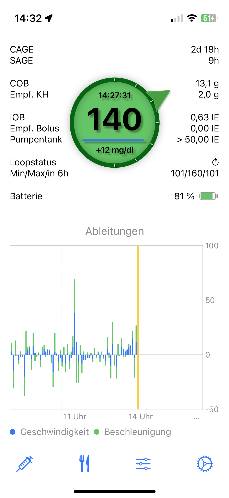
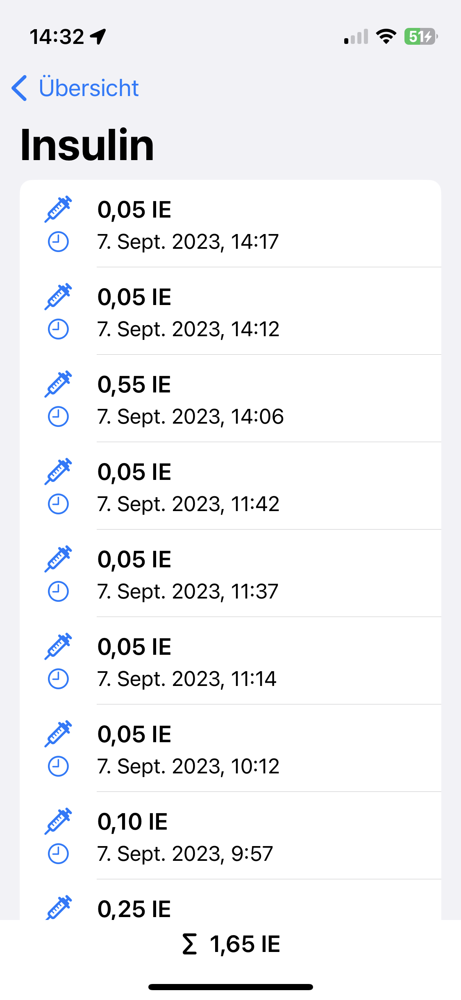
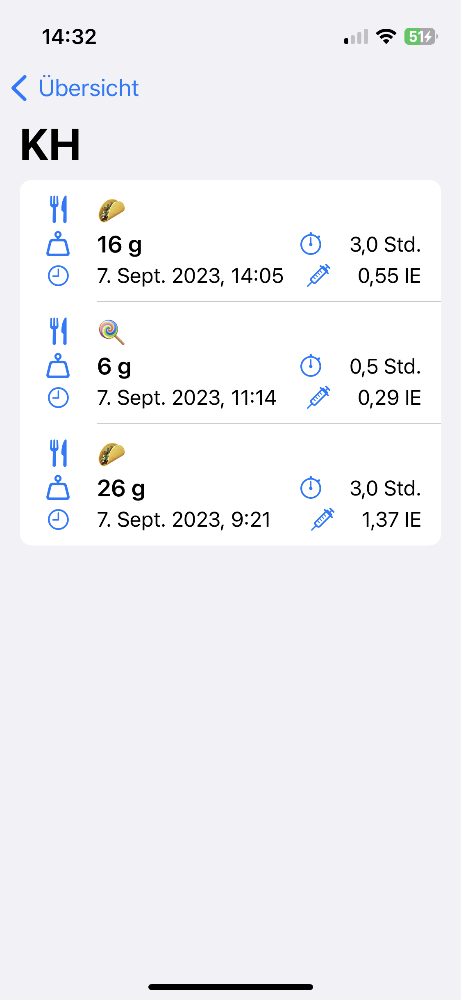
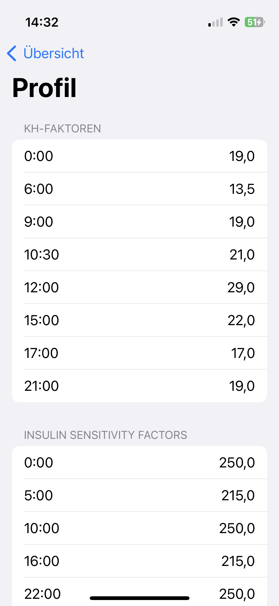
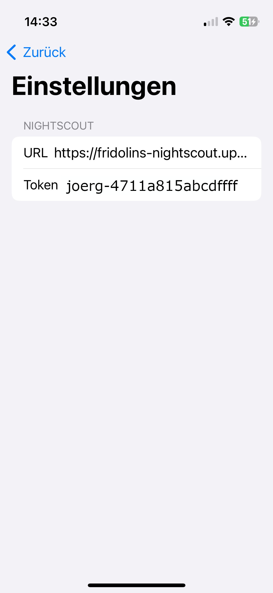

# Loop-Follower

A small and simple Nightscout-Viewer

## BG View

---

## Subviews

### Basal View

From BG view swipe up to see the basal view.

The dashed line shows the planned basal. The blue filled area is the actual basal.

## Derived View

From BG view swipe down to see the derived view

The velocity is painted in blue and the acceleration is painted in green.

## Buttons on the bottom

### Insulin-Entries

### Carb-Entries

### Profile

### Settings

